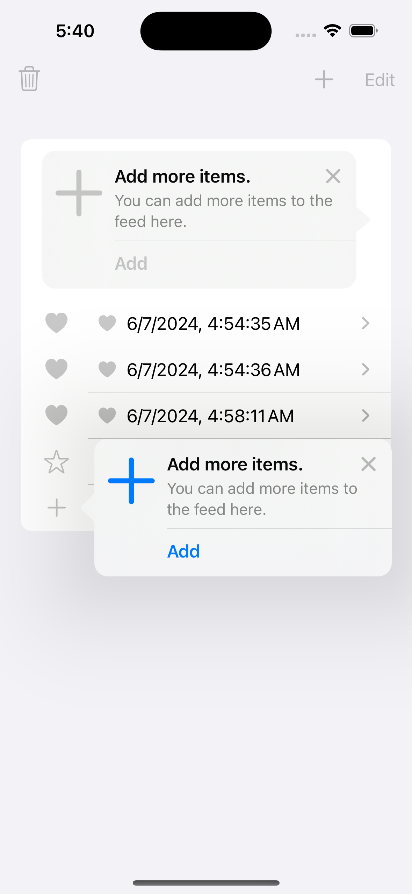
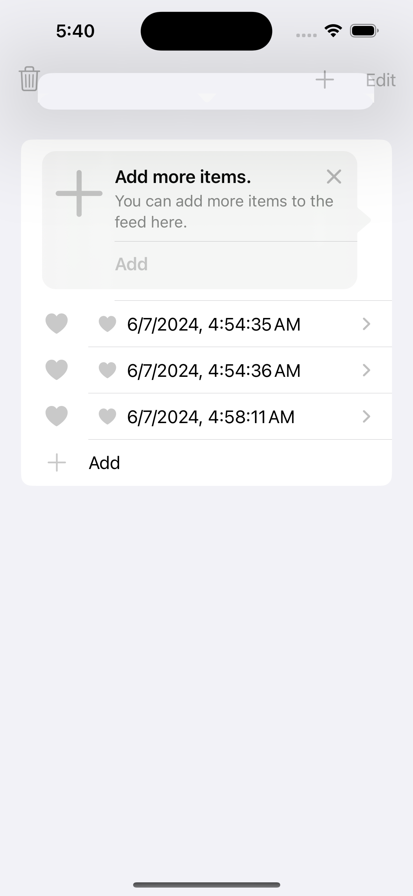

# Features

## TipKit

TipKit framework provides us to build custom rules is events. An event is a user action we can donate to. The main difference with the parameters is the persistence. Framework automatically stores the number of events that happened.

Define rules to control when a tip should be displayed
TipKit offers two ways to do this: based on Parameters and on Events.

### Tip, Rules, Events
Tip consists of a Image, Title, Message, Action

### Button animation on a row
Image symbol and button animatio with SFSymbol. Action on a list table row

### Demo Image: 

#### References: 

https://asynclearn.medium.com/define-rules-for-displaying-tips-in-tipkit-741d0d3d505f

https://swiftwithmajid.com/2024/05/15/discovering-app-features-with-tipkit-rules/

